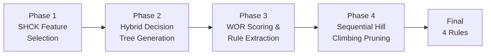

# Deep Analysis: Reproducing, Extending, and Improving DiabeRules

> A complete beginner-friendly guide to understanding every concept in this paper and its implementation.

---

## Table of Contents

1. [What Is This Paper About? (The Big Picture)](#1-the-big-picture)
2. [The Medical Problem: Diabetes](#2-diabetes)
3. [Why Do We Need "Transparent" AI in Medicine?](#3-transparency)
4. [Foundational Machine Learning Concepts](#4-ml-concepts)
5. [The DiabeRules Pipeline — Phase by Phase](#5-diaberules-pipeline)
6. [The Datasets](#6-datasets)
7. [Evaluation Metrics Explained](#7-metrics)
8. [The Four Methodological Limitations Discovered](#8-limitations)
9. [The Four Proposed Fixes](#9-fixes)
10. [Results and What They Mean](#10-results)
11. [Key Takeaways](#11-takeaways)
12. [Glossary of All Terms](#12-glossary)
13. [Mapping to the Code Implementation](#13-code-mapping)

---

## 1. What Is This Paper About? (The Big Picture) {#1-the-big-picture}

This paper does **four things**:

1. **Reproduces** an existing system called "DiabeRules" — a diabetes prediction tool that uses simple, human-readable rules instead of black-box AI.
2. **Extends** the system to a much larger hospital dataset (UCI 130-US Hospitals).
3. **Identifies problems** (methodological limitations) in the original paper's approach, especially when applied to the larger dataset.
4. **Proposes fixes** for each problem and shows they work.

> [!IMPORTANT]
> The core tension in this paper: **accuracy vs. interpretability**. Complex models (like XGBoost) are more accurate but are "black boxes" — nobody can explain *why* they made a prediction. DiabeRules sacrifices a little accuracy to produce just **4 simple rules** a doctor can read and verify.

### The Two Papers

| | Base Paper (DiabeRules) | Your Paper (Reproduction) |
|---|---|---|
| **Authors** | Boruah & Biswas (2026) | Your work |
| **Goal** | Create transparent diabetes rules | Reproduce, critique, and improve |
| **Datasets** | Pima + UCI | Pima + UCI |
| **Pima accuracy** | 89.23% | ✅ Reproduced (89.32%) |
| **UCI accuracy** | 90.84% (claimed) | ❌ Not reproducible → 62.93% |

---

## 2. The Medical Problem: Diabetes {#2-diabetes}

### What Is Diabetes?

Diabetes mellitus is a **chronic metabolic disorder** where the body cannot properly regulate blood sugar (glucose).

- **Type 1** (~10%): The pancreas cannot produce insulin. Usually diagnosed in children.
- **Type 2** (~90%): The body becomes resistant to insulin. Usually linked to lifestyle factors like obesity.

### Why Early Detection Matters

- 422 million affected worldwide; projected 642 million by 2040
- 1.6 million deaths/year directly
- **46.5% of diabetic individuals are undiagnosed**
- Early lifestyle changes can prevent or delay Type 2 diabetes

### The Two Key Risk Factors (from DiabeRules)

The paper discovers that **two measurable values** are the strongest predictors:

| Risk Factor | What It Is | Safe Range (from rules) |
|---|---|---|
| **Plasma Glucose (X2)** | Blood sugar level after fasting/glucose test | ≤ 143.5 mg/dL |
| **BMI (X6)** | Body Mass Index = weight(kg) / height(m)² | 22.95 – 27.35 kg/m² |

> [!TIP]
> The merged rule says: **IF your glucose is ≤ 143.5 AND your BMI is between 22.95–27.35, THEN you are likely Non-Diabetic.** This is exactly the kind of actionable guidance a doctor can give a patient.

---

## 3. Why Do We Need "Transparent" AI in Medicine? {#3-transparency}

### Black-Box vs. Transparent Models

```
BLACK-BOX MODEL (e.g., XGBoost, Neural Network):
  Input: [Glucose=150, BMI=30, Age=45, ...] → Output: "Diabetic" (87.5% accuracy)
  Doctor: "WHY is this patient diabetic?" → Model: "¯\_(ツ)_/¯"

TRANSPARENT MODEL (DiabeRules):
  Rule: IF Glucose ≤ 143.5 AND BMI ∈ [22.95, 27.35] THEN Non-Diabetic
  Doctor: "I can verify this makes medical sense!" ✓
  Patient: "I need to get my BMI below 27.35!" ✓
```

### Comprehensibility Metrics

- **Global comprehensibility** = number of rules (DiabeRules: **4 rules** vs. Random Forest: hundreds)
- **Local comprehensibility** = number of conditions across all rules (DiabeRules: **12 conditions**)

### Decision Support System (DSS)

A DSS is any computer system that helps humans make decisions. DiabeRules is a **rule-based expert system** — it encodes expert knowledge as IF-THEN rules, mimicking how a doctor reasons.

---

## 4. Foundational Machine Learning Concepts {#4-ml-concepts}

### 4.1 Classification

Classification = assigning a label to an input. Here:
- **Input**: Patient's medical measurements (8 features)
- **Output**: Class 0 (Non-Diabetic) or Class 1 (Diabetic)

### 4.2 Decision Trees

A decision tree is a flowchart-like structure:

```
                    [Glucose ≤ 127.5?]
                    /              \
                 YES                NO
                  |                  |
          [BMI ≤ 26.45?]      [BMI ≤ 29.95?]
           /        \            /        \
        YES          NO       YES          NO
         |            |        |            |
    Non-Diabetic   (...)    (...)      Diabetic
```

Each path from root to leaf = one **production rule (P-Rule)**:
```
IF Glucose ≤ 127.5 AND BMI ≤ 26.45 THEN Non-Diabetic
```

### 4.3 C4.5 Algorithm & Information Gain Ratio

C4.5 is the algorithm that *builds* the decision tree. At each node, it must choose which feature to split on.

**Information Gain** measures how much a split reduces uncertainty (entropy):
- **Entropy** = measure of disorder. If a group is 50/50 diabetic/non-diabetic, entropy is maximum (1.0). If it's 100% one class, entropy is 0.
- **Information Gain** = entropy(parent) − weighted average entropy(children)
- **Gain Ratio** = Information Gain ÷ Split Information (normalizes for features with many values)

C4.5 picks the feature with the **highest gain ratio** at each split.

### 4.4 Feature Selection

Not all features are useful. Feature selection finds the best subset:

| Type | How It Works | Example |
|---|---|---|
| **Filter** | Scores features independently using statistics | Information Gain Ratio |
| **Wrapper** | Tests subsets by training a model and checking accuracy | SHCK (used in DiabeRules) |
| **Hybrid** | Combines both | DiabeRules (wrapper SHCK + filter C4.5) |

### 4.5 Cross-Validation (CV)

Cross-validation prevents **overfitting** (memorizing training data instead of learning patterns).

**K-Fold CV (K=10)**:
```
Split data into 10 equal parts ("folds")
For each fold i:
    Train on folds 1..10 except i
    Test on fold i
Report average performance across all 10 test folds
```

**Nested CV** (more rigorous — what this paper implements):
```
OUTER loop (10 folds): estimates real-world performance
  INNER loop (5 folds): tunes hyperparameters
  → The test fold is NEVER touched during tuning
```

> [!WARNING]
> **Data leakage** occurs when information from the test set "leaks" into training, giving artificially high scores. The paper argues the original DiabeRules UCI results likely suffer from this.

### 4.6 Class Imbalance & SMOTE

**Class imbalance** = one class has far more samples than the other.

In Pima: 500 Non-Diabetic (65%) vs. 268 Diabetic (35%) — **imbalanced**.

**SMOTE** (Synthetic Minority Over-sampling Technique) creates artificial minority-class samples:
```
Original minority sample:     x₁ = [Glucose=180, BMI=35]
Nearest minority neighbor:    x₂ = [Glucose=160, BMI=33]
Random λ ∈ [0,1], say λ=0.4:
Synthetic sample:             x_new = x₁ + 0.4*(x₂ - x₁) = [Glucose=172, BMI=34.2]
```

This works well for **continuous features** but breaks for **binary features** (see Limitation 1).

### 4.7 SHAP (SHapley Additive exPlanations)

SHAP is a method to explain which features matter most for a model's predictions. It comes from game theory (Shapley values).

- Each feature gets a score = its average contribution to the prediction
- Higher SHAP value → more important feature
- The paper uses SHAP to confirm that Glucose and BMI are dominant (consistent with the rule-based analysis)

---

## 5. The DiabeRules Pipeline — Phase by Phase {#5-diaberules-pipeline}

DiabeRules operates in **4 sequential phases**:



### Phase 1: SHCK Feature Selection

**SHCK** = Stochastic Hill Climbing with K-Nearest Neighbour

**Concept — Hill Climbing**: Imagine you're blindfolded on a hilly landscape trying to reach the highest peak. You feel the ground around you and step in the direction that goes up. "Stochastic" means you add randomness to avoid getting stuck on small hills.

**How SHCK works**:
1. Start with ALL features (8 for Pima)
2. Cluster features into K groups based on distance from centroids
3. Calculate a "score" for each feature based on its cluster-distance
4. Randomly pick a feature to REMOVE (probability proportional to score)
5. Train a decision tree WITHOUT that feature
6. If accuracy stays the same or improves → keep the removal
7. Otherwise → put the feature back
8. Repeat for max iterations

**Result on Pima**: Selects 6 out of 8 features: X1 (Pregnancies), X2 (Glucose), X5 (Insulin), X6 (BMI), X7 (Pedigree), X8 (Age). Drops X3 (Blood Pressure) and X4 (Skin Thickness).

### Phase 2: Hybrid Decision Tree Rule Generation

Train a C4.5 decision tree using the selected features. Called "hybrid" because it combines:
- **Wrapper** feature selection (SHCK from Phase 1)
- **Filter** splitting criterion (information gain ratio in C4.5)

Each root-to-leaf path becomes a rule.

### Phase 3: WOR Scoring & Rule Extraction

**WOR** (Weightage of Rule) is a formula that scores how "good" each rule is:

```
WOR = (CC - IC)/(CC + IC) + CC/(IC + 1) - IC/CC + CC/RL
```

| Symbol | Meaning | Why It Matters |
|---|---|---|
| **CC** | Correctly Classified samples at leaf | More correct → higher score |
| **IC** | Incorrectly Classified samples at leaf | More errors → lower score |
| **RL** | Rule Length (number of conditions) | Shorter rules → higher score (simpler is better) |

**Key implementation detail**: CC and IC must be **absolute counts** from `tree_.n_node_samples`, not normalized proportions from `tree_.value`.

From each of the 10 training folds, the **highest-WOR rule** is extracted → 10 rules form the **Initial Transparent Ruleset**.

### Phase 4: Sequential Hill Climbing Rule Pruning

The pruning algorithm systematically tries removing each rule:

```python
while changes_made:
    for each rule in ruleset:
        temporarily remove rule
        if accuracy does NOT decrease:
            permanently remove rule
            break  # restart from beginning
    if no rule was removed:
        stop
```

**Result**: 10 rules → **4 final rules** (Table IV in the paper).

### The 4 Final "Intelligible Insight Rules"

All 4 rules predict **Non-Diabetic (Class 0)** and use only **Glucose (X2)** and **BMI (X6)**:

| Rule | Conditions | Class |
|---|---|---|
| 1 | X2 ≤ 143.5 AND X6 ≤ 26.35 AND X2 ≤ 114.5 | Non-Diabetic |
| 2 | X2 ≤ 123.5 AND X6 ≤ 27.35 AND X2 ≤ 106.5 | Non-Diabetic |
| 3 | X2 ≤ 127.5 AND X6 ≤ 26.45 AND X6 > 22.95 | Non-Diabetic |
| 4 | X2 ≤ 127.5 AND X6 ≤ 26.45 AND X2 ≤ 106.5 | Non-Diabetic |

These merge into one rule: **IF Glucose ≤ 143.5 AND 22.95 < BMI ≤ 27.35 THEN Non-Diabetic**

Anything not matching these rules gets the **default class** (majority class of unmatched samples).

---

## 6. The Datasets {#6-datasets}

### Pima Indian Diabetes Dataset

| Property | Value |
|---|---|
| Samples | 768 |
| Features | 8 (all continuous/integer) |
| Class split | 500 Non-Diabetic (65%), 268 Diabetic (35%) |
| Source | UCI ML Repository, from Arizona, USA |
| Population | Female Pima Indian patients |

**The 8 Features**:

| Code | Name | Type | Medical Meaning |
|---|---|---|---|
| X1 | Pregnancies | Integer | Number of pregnancies |
| X2 | Glucose | Continuous | Plasma glucose after oral test |
| X3 | BloodPressure | Continuous | Diastolic blood pressure (mm Hg) |
| X4 | SkinThickness | Continuous | Triceps skin fold (mm) |
| X5 | Insulin | Continuous | 2-hour serum insulin (mu U/ml) |
| X6 | BMI | Continuous | Body mass index (kg/m²) |
| X7 | Pedigree | Continuous | Diabetes pedigree function (genetic risk) |
| X8 | Age | Integer | Age in years |

**Preprocessing**: Physiologically impossible zero values in X2–X6 replaced with column medians.

### UCI 130-US Hospitals Dataset

| Property | Value |
|---|---|
| Samples | 101,766 |
| Raw features | 50 |
| After encoding | ~300 (one-hot encoded) |
| Class split | 54,864 Readmitted (54%), 46,902 Not (46%) — **near-balanced** |
| Source | 130 US hospitals, 1999–2008 |
| Target | Hospital readmission (not diabetes diagnosis) |

**Preprocessing chain** (defined by this paper since the original omits it):
1. Drop ID columns + high-missing columns (weight 97% missing, payer_code, medical_specialty)
2. Decode admission/discharge/source IDs via mapping file
3. Convert age bands like "[50-60)" to numeric midpoint (55)
4. Group ICD-9 diagnosis codes into clinical categories (Circulatory, Respiratory, etc.)
5. Remove near-constant columns (≥99.5% single value)
6. One-hot encode all categorical features (~300 binary columns)

---

## 7. Evaluation Metrics Explained {#7-metrics}

### Confusion Matrix (the foundation of all metrics)

```
                    Predicted
                  Pos    Neg
Actual  Pos  [  TP  |  FN  ]    ← Diabetic patients
        Neg  [  FP  |  TN  ]    ← Non-Diabetic patients
```

| Metric | Formula | Plain English |
|---|---|---|
| **Accuracy** | (TP+TN) / Total | % of all predictions that are correct |
| **Precision** | TP / (TP+FP) | Of those predicted positive, how many actually are? |
| **Recall** (Sensitivity) | TP / (TP+FN) | Of actual positives, how many did we catch? |
| **F1 Score** | 2 × (Prec × Rec) / (Prec + Rec) | Harmonic mean of precision and recall |
| **Macro-F1** | (F1_class0 + F1_class1) / 2 | Average F1 across both classes equally |
| **MCC** | Matthews Correlation Coefficient | Balanced metric even with imbalanced classes, range [-1, +1] |
| **AUC-ROC** | Area Under ROC Curve | How well the model separates classes across all thresholds |

> [!NOTE]
> **Why accuracy alone is misleading**: If 90% of patients are non-diabetic, a model that always says "Non-Diabetic" gets 90% accuracy but 0% recall — it misses every diabetic patient! This is why the paper emphasizes F1, precision, AND recall.

---

## 8. The Four Methodological Limitations Discovered {#8-limitations}

### Limitation 1: SMOTE on One-Hot Encoded Features

**Problem**: Standard SMOTE interpolates between samples: `x_new = x₁ + λ(x₂ - x₁)`.

For continuous features (Pima), this works: interpolating Glucose=150 and Glucose=170 gives a valid Glucose=160.

For binary one-hot features (UCI), it produces **impossible values**:
```
Patient A: discharge_Home = 1, discharge_ICU = 0
Patient B: discharge_Home = 0, discharge_ICU = 1
SMOTE (λ=0.43): discharge_Home = 0.43, discharge_ICU = 0.57  ← IMPOSSIBLE!
```
A patient can't be 43% discharged home. This corrupts the decision tree's splits.

### Limitation 2: Accuracy-Based Pruning on Near-Balanced Data

**Problem**: UCI is ~54% class-1 (readmitted). A trivial model always predicting "Readmitted" gets ~54% accuracy.

The pruning algorithm removes rules if accuracy doesn't drop. It can remove ALL class-1 rules one by one (each removal costs < 1% accuracy) until the model degenerates into a constant predictor.

**Result**: Recall collapses to 0% (catches no readmitted patients) while accuracy stays high.

### Limitation 3: Single-Run SHCK Instability

**Problem**: With 8 features (Pima), SHCK's random search is stable. With ~300 features (UCI), different random seeds give wildly different feature selections — sometimes dropping clinically important features like `number_inpatient`.

### Limitation 4: UCI Evaluation Leakage

**Problem**: The paper claims 90.84% accuracy on UCI but provides no preprocessing details. Four structural indicators suggest data leakage:

1. No preprocessing description given
2. The paper itself warns about overly optimistic estimates
3. In the base paper, **every single model** performs better on UCI than on Pima (statistically implausible for a harder dataset)
4. Published benchmarks place UCI state-of-the-art at 62–68%

---

## 9. The Four Proposed Fixes {#9-fixes}

### Fix 1: BorderlineSMOTE with Ratio Guard

**BorderlineSMOTE**: Only creates synthetic samples near the decision boundary (where classification is hardest), reducing corrupt interpolations.

**Ratio Guard**: Only applies resampling when genuinely needed:
```
Apply BorderlineSMOTE only if (minority_count / majority_count) < 0.6
```
For UCI (ratio ~0.85), most folds skip resampling — correct for near-balanced data.

### Fix 2: Enhanced WOR with Minority Recall Bonus (λ)

Adds a bonus term to the WOR formula:
```
WOR_enhanced = WOR_base + λ × (CC_minority / Total_minority)
```
- λ = 0.1 (small bonus; λ=0.3 was too aggressive — recall hit 90% but precision collapsed to 50%)
- Encourages keeping rules that correctly classify minority-class samples

### Fix 3: Macro-F1 Sequential Hill Climbing Pruning

Replaces accuracy as the pruning objective with **macro-F1**:
```
Accept rule removal only if macro-F1 does NOT decrease
macro-F1 = (F1_class0 + F1_class1) / 2
```
Since macro-F1 weights both classes equally, the pruner can't collapse into a constant predictor.

### Fix 4: Majority-Vote SHCK

Run SHCK **5 times** with different random seeds. Keep only features selected by more than half the runs:
```
S_final = { feature_i : vote_count(i) > 5/2 }
```
This stabilizes feature selection on high-dimensional data.

---

## 10. Results and What They Mean {#10-results}

### Pima Results ✅

| Configuration | Accuracy | Recall | Precision | F1 |
|---|---|---|---|---|
| DiabeRules (paper) | 89.23% | 86.04% | 83.81% | 85.02% |
| Reproduction (train=test) | 89.32% | 95.52% | 78.53% | 86.20% |
| Reproduction (nested CV) | 93.23% | 84.33% | 95.76% | 89.68% |

**All four rules reproduced exactly.** WOR values match. SHAP confirms Glucose and BMI dominate.

### UCI Results — The Progression (v1 → v2 → v3)

| Version | Accuracy | Recall | Precision | F1 | Problem |
|---|---|---|---|---|---|
| **v1** (original) | 62.76% | 45.72% | 63.29% | 53.09% | Low recall — misses readmissions |
| **v2** (overcorrected) | 53.87% | 89.97% | 49.98% | 64.26% | Low precision — too many false alarms |
| **v3** (balanced) | 62.93% | 53.78% | 61.12% | 57.22% | ✅ Balanced trade-off |
| Paper (claimed) | 90.84% | 88.41% | 85.74% | 87.05% | ❌ Not reproducible |

The **28-percentage-point gap** between 62.93% and 90.84% is too large for implementation differences — it points to structural evaluation issues.

> [!IMPORTANT]
> The v3 results (62.93% accuracy) are **consistent with published clinical benchmarks** on this dataset, where even state-of-the-art ensemble methods achieve only 62–68% accuracy and AUC of 0.63–0.70.

---

## 11. Key Takeaways {#11-takeaways}

1. **Transparency has real value**: 4 readable rules can match 89% accuracy on Pima, outperforming black-box models
2. **Methods that work on small datasets may fail on large ones**: Every DiabeRules component broke when scaled from 8 to 300 features
3. **Accuracy alone is dangerous**: On balanced datasets, a model can achieve decent accuracy by being a constant predictor
4. **Reproducibility matters**: Without preprocessing details, no result can be verified
5. **The precision-recall trade-off is fundamental**: You can't maximize both simultaneously — the right balance depends on clinical context
6. **Nested cross-validation is essential**: Using the same data for selection, training, and evaluation inflates metrics

---

## 12. Glossary of All Terms {#12-glossary}

| Term | Definition |
|---|---|
| **AUC-ROC** | Area Under the Receiver Operating Characteristic curve; measures class separation ability |
| **Black-box model** | A model whose internal logic is opaque to users (e.g., neural networks, ensemble methods) |
| **BorderlineSMOTE** | SMOTE variant that only generates synthetic samples near the decision boundary |
| **C4.5** | Decision tree algorithm using information gain ratio for splitting |
| **CC (Correctly Classified)** | Number of training samples correctly predicted by a rule's leaf node |
| **Class imbalance** | When one class has significantly more samples than another |
| **Cross-validation** | Technique to estimate model performance by rotating train/test splits |
| **Data leakage** | When test-set information contaminates training, inflating performance metrics |
| **Decision tree** | A tree-structured classifier where each internal node is a feature test |
| **DSS (Decision Support System)** | Computer system aiding human decision-making |
| **Entropy** | Measure of disorder/uncertainty in a set of class labels |
| **Expert system** | AI system encoding domain expert knowledge as rules |
| **F1 Score** | Harmonic mean of precision and recall |
| **Feature selection** | Process of choosing the most relevant input variables |
| **Hill Climbing** | Optimization technique that iteratively moves toward better solutions |
| **Hyperparameter** | Setting configured before training (e.g., tree depth, leaf size) |
| **IC (Incorrectly Classified)** | Samples misclassified by a rule's leaf node |
| **ICD-9** | International Classification of Diseases, 9th revision — standardized diagnosis codes |
| **Information Gain Ratio** | Normalized measure of how well a feature splits the data |
| **Macro-F1** | F1 averaged equally across all classes |
| **MCC** | Matthews Correlation Coefficient — balanced metric for binary classification |
| **Nested CV** | Two-level cross-validation: outer for evaluation, inner for tuning |
| **One-hot encoding** | Converting categorical variable with N values into N binary (0/1) columns |
| **Overfitting** | Model memorizes training data noise instead of learning true patterns |
| **P-Rule (Production Rule)** | An IF-THEN decision rule extracted from a tree path |
| **Precision** | Fraction of positive predictions that are actually positive |
| **Recall (Sensitivity)** | Fraction of actual positives correctly identified |
| **RL (Rule Length)** | Number of conditions in a rule |
| **SHAP** | SHapley Additive exPlanations — game-theory-based feature importance |
| **SHCK** | Stochastic Hill Climbing with K-nearest neighbour feature selection |
| **SMOTE** | Synthetic Minority Over-sampling Technique |
| **SMOTE-ENN** | SMOTE + Edited Nearest Neighbours (combines oversampling with cleaning) |
| **Stratified K-Fold** | K-Fold CV preserving class proportions in each fold |
| **WOR (Weightage of Rule)** | Scoring function that ranks rules by correctness, purity, and simplicity |

---

## 13. Mapping to the Code Implementation {#13-code-mapping}

### Project Structure

| File | Purpose |
|---|---|
| [diaberules_pima.py](file:///Users/khushalbhasin/Documents/code/sc_project/diaberules_pima.py) | Pima dataset: SHCK + C4.5 + WOR + pruning + SHAP |
| [diaberules_uci.py](file:///Users/khushalbhasin/Documents/code/sc_project/diaberules_uci.py) | UCI v1/v2: SMOTE-ENN, majority-vote SHCK, F1 pruning |
| [diaberules_uci_2.py](file:///Users/khushalbhasin/Documents/code/sc_project/diaberules_uci_2.py) | UCI v3: BorderlineSMOTE, macro-F1 pruning (final improved version) |
| [diabetes.csv](file:///Users/khushalbhasin/Documents/code/sc_project/diabetes.csv) | Pima dataset (768 rows, 9 columns) |
| [uci_dataset/](file:///Users/khushalbhasin/Documents/code/sc_project/uci_dataset) | UCI dataset (101K rows) + IDS_mapping.csv |
| [diabetes_paper.txt](file:///Users/khushalbhasin/Documents/code/sc_project/diabetes_paper.txt) | Original DiabeRules base paper |
| [sc_paper_final.txt](file:///Users/khushalbhasin/Documents/code/sc_project/sc_paper_final.txt) | Your reproduction/extension paper |

### How Paper Concepts Map to Code

| Paper Concept | Code Location | Key Function/Variable |
|---|---|---|
| Phase 1: SHCK | `diaberules_pima.py:50-80` | `shck()`, `compute_cluster_scores()` |
| Phase 1: Majority-Vote SHCK | `diaberules_uci_2.py:280-292` | `shck_majority_vote()` — 5 restarts |
| Phase 2: C4.5 Decision Tree | All files | `DecisionTreeClassifier(criterion='entropy')` |
| Phase 3: WOR scoring | `diaberules_pima.py:117-119` | `compute_wor(CC, IC, RL)` |
| Phase 3: Enhanced WOR (λ) | `diaberules_uci_2.py:349-359` | `compute_wor(..., lam=0.1)` |
| Phase 3: Rule extraction | `diaberules_pima.py:93-114` | `extract_rules_from_dt()` |
| Phase 4: Accuracy pruning | `diaberules_pima.py:156-165` | `sequential_hill_climbing_prune()` |
| Phase 4: Macro-F1 pruning | `diaberules_uci_2.py:433-457` | Uses `f1_score(average="macro")` |
| SMOTE (original) | `diaberules_pima.py:183` | `SMOTE(random_state=42)` |
| BorderlineSMOTE + guard | `diaberules_uci_2.py:483-497` | Checks ratio before applying |
| SHAP analysis | `diaberules_pima.py:195-206` | `shap.TreeExplainer(dt)` |
| UCI preprocessing | `diaberules_uci_2.py:160-224` | `load_uci_data()` — full chain |
| ICD-9 grouping | `diaberules_uci_2.py:114-142` | `categorize_diagnosis()` |
| Default class (adaptive) | `diaberules_uci_2.py:404-412` | `compute_default_class()` |

### Version Progression in Code

```
diaberules_pima.py     → Paper reproduction (Pima only)
                          Uses: SMOTE, accuracy pruning, single SHCK

diaberules_uci.py      → v1/v2 (UCI attempts)
                          Uses: SMOTE-ENN, binary F1 pruning, λ=0.3
                          Problem: Overcorrected (v2 had 90% recall, 50% precision)

diaberules_uci_2.py    → v3 (final improved)
                          Uses: BorderlineSMOTE, macro-F1 pruning, λ=0.1
                          Result: Balanced 53.78% recall, 61.12% precision
```
